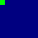
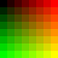

**pixel-animator** is a library for creating small, colorful, pixel-based animations with JavaScript. It's pretty much the same idea as a [fragment shader](https://en.wikipedia.org/wiki/Shader#Pixel_shaders) from graphics programming, but much slower and maybe more fun to write.


## Getting Started

The quickest way to get started is to do one of these things:

- [Remix the project on Glitch](https://glitch.com/edit/#!/remix/pixel-animator)
- [Fork the template on CodeSandbox](https://codesandbox.io/s/pixel-animator-starter-od1oy)

Alternatively, you can load the `pixel-animator.js` file from the web into your own HTML page. The script defines a global variable `PixelAnimator` for you to use, and you'll need an element like `<div id="root" />` shown in the examples so that the animation has a place to live on the page.

```html
<html>
  <head>
    <script src="https://unpkg.com/pixel-animator/pixel-animator.js"></script>
  </head>
  <body>
    <div id="root"></div>
    <script>
      // Insert a default animation inside div#root
      PixelAnimator({}, document.getElementById("root"));
    </script>
  </body>
</html>
```

Another option is to import the module into your Node.js project with `npm install pixel-animator` and `require("pixel-animator")`.

## How to make an animation

To make an animation you have to write at least one function. An essential function named `colorize` is responsible for converting a pixel's position on the screen into a color. A less important, optional function named `evolve` is responsible for communicating data from one frame to the next.

## Writing a `colorize` function

Once you're set up, all you need to do is write a special kind of function called `colorize`. The purpose of the `colorize` function is to convert each pixel's position in space and time into a color. Each pixel in an animation belongs to a coordinate in space and time given by its `column`, `row` and `frame` numbers. Your `colorize` function will run automatically for every coordinate in the animation, converting each one to a color, finally rendering the animated result in the browser.

### Example 1: White pixel blinking on a grey background


```javascript
const PixelAnimator = require("pixel-animator");

function colorize({ column, row, frame }) {
  if (column === 5 && row === 2 && frame % 2 === 0) {
    return 1;
  } else {
    return 0.25;
  }
}

PixelAnimator({ colorize }, document.getElementById("root"));
```

[[Run this code](https://codesandbox.io/s/bright-green-dot-blinking-on-a-dark-blue-background-9dwjg)]

In this function, each pixel says to itself: _If I'm in the sixth column, third row, and my frame number is even, I should be white. If not, make me dark grey_. The values `1` and `0.25` represent white and dark grey.

The example also includes some code needed to attach the animation to the DOM.

---

### Example 2: Green pixel moving across a blue background



```javascript
function colorize({ column, row, frame }) {
  if (column === frame && row === frame) {
    return { green: 1 };
  } else {
    return { blue: 0.5 };
  }
}
```

[[Run this code](https://codesandbox.io/s/green-dot-moving-on-a-diagonal-path-v6gpt)]

Here each pixel says to itself: _If both my column and row numbers are equal to my frame number, I should be bright green. If not, make me dark blue_. This logic causes the green pixel to trace a diagonal line as the frame number increases over time.

---

### Example 3: Animated gradient



```javascript
function colorize({
  // Current pixel coordinates
  column,
  row,
  frame,
  // Overall dimensions for comparison
  columns,
  rows,
  frames
}) {
  return {
    red: column / columns,
    green: row / rows,
    blue: frame / frames
  };
}
```

[[Run this code](https://codesandbox.io/s/example-animated-gradient-c0gnl)]

## Writing an optional `evolve` function

Writing an `evolve` function will let you make more interesting things that can't be done with `colorize` alone. It's job is to mutate and forward information from one frame to the next and allows you work with other kinds of data beyond color.

_\* I'll write more later, but `evolve` is a supported feature. See [cellular automata](https://en.wikipedia.org/wiki/Cellular_automaton) for now._

## Rendering outside of a web browser

Pixel Animator is primarily meant to be used with a web browser, but it's not a requirement. Perhaps you'd like to render your animation in some other form, like a video file or animated GIF.

The `PixelAnimator` function accepts a DOM node as its second argument. That
argument is optional, and if you omit it you'll get a kind of iterator function in return. The iterator returns raw color data one frame at a time, which you're free to handle however you like.

```js
// Get a frame iterator for the animation
const getNextFrame = PixelAnimator({ colorize });

// Call it repeatedly to get one frame of color data at a time
const frame1 = getNextFrame();
const frame2 = getNextFrame();
const frame3 = getNextFrame();
```
