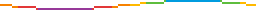

**Pixel Animator** is a toy for making colorful, animated pixel art with JavaScript. Kind of like graphics programming but less powerful and more fun.

## Getting Started

### The easy way

1. Start with a template on [Glitch](https://glitch.com/edit/#!/remix/pixel-animator-template) or [CodePen](https://codepen.io/grough/pen/JjopKEZ?editors=1000)
2. Read the [tutorial](https://github.com/grough/pixel-animator/wiki/Pixel-Animator-Tutorial)
3. Enjoy?

If you want to make your own web page or install the Node.js module, take a look at the [installation notes](https://github.com/grough/pixel-animator/wiki/Installation).

## There's more…

Some features aren't documented yet. The [wiki](https://github.com/grough/pixel-animator/wiki) is under development.
